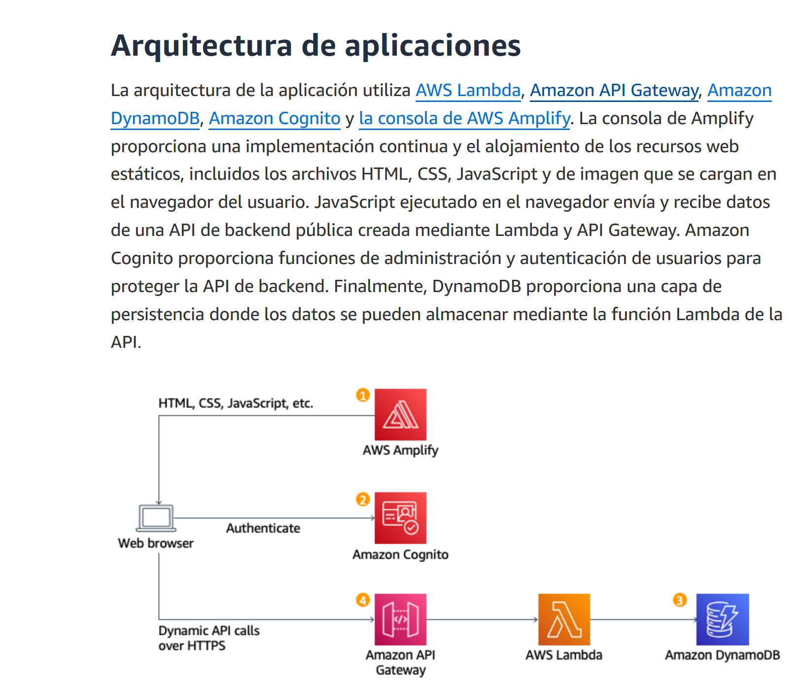
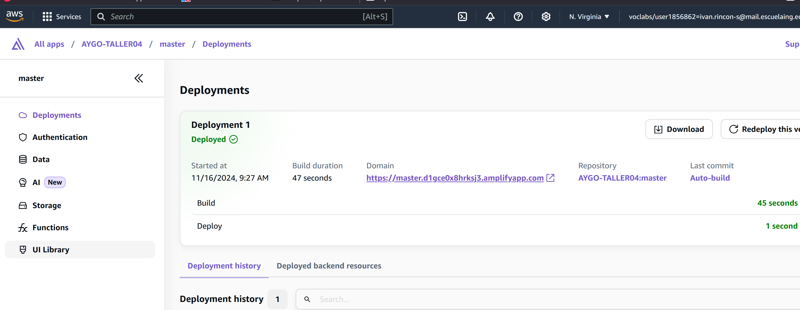
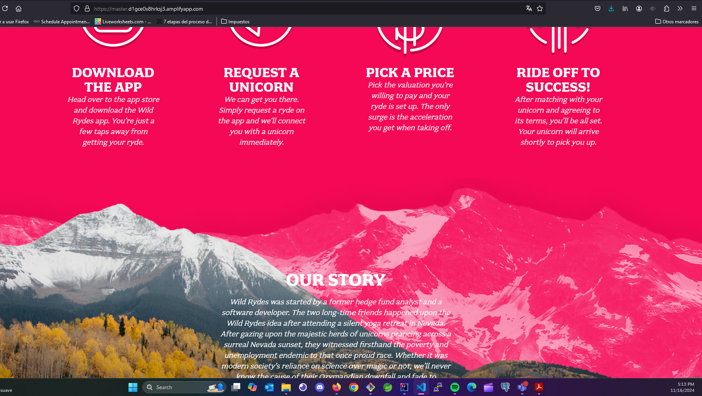
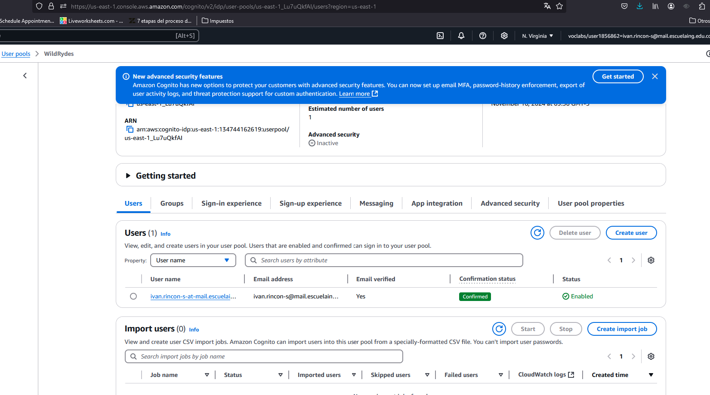
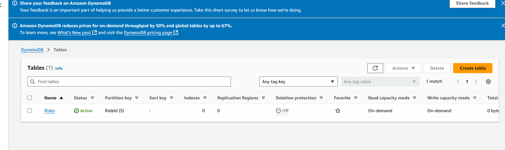
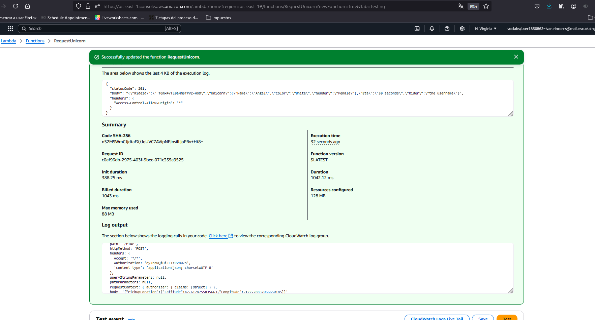

# AYGO-TALLER04

## AWS Serverless Application Model
Click on [AWS Serverless Application Model](https://aws.amazon.com/es/getting-started/hands-on/build-serverless-web-app-lambda-apigateway-s3-dynamodb-cognito/) to open the resource.
 
### Arquitectura propuesta




## Módulo 1: alojamiento web estático con implementación continua

Para comenzar, configurará AWS Amplify para alojar los recursos estáticos de la aplicación web con implementación continua integrada.

para copiar el repositorio usamos el siguiente comando
```bash
aws s3 cp s3://ttt-wildrydes/wildrydes-site ./ --recursive
```

## Habilitar AWS Amplify
A continuación, utilizará la consola de AWS Amplify para implementar el sitio web que acaba de confirmar en Git. La consola de Amplify se encarga de configurar un lugar para almacenar el código de la aplicación web estática y proporciona varias capacidades útiles que simplifican el ciclo de vida de la aplicación y permiten las prácticas recomendadas




validamos que este funcionando 




## Módulo 2: administrar usuarios

Creará un grupo de usuarios de Amazon Cognito para administrar las cuentas de los usuarios.
Información general

En este módulo va a crear un grupo de usuarios de Amazon Cognito para administrar las cuentas de los usuarios. Implementará páginas que permiten a los clientes registrarse como nuevo usuario, verificar su dirección de correo electrónico e iniciar sesión en el sitio.


actualizamos el archivo config.js

El archivo js/config.js contiene la configuración del ID de grupo de usuarios, el ID de cliente de aplicación y la región. Actualice este archivo con la configuración de la aplicación y el grupo de usuarios que creó en los pasos anteriores y vuelva a cargar el archivo en el bucket.

    Desde la máquina local, abra el archivo wildryde-site/js/config.js en el editor de texto que prefiera.
    Actualice la sección de Cognito del archivo con los valores correctos para el ID del grupo de usuarios y el ID del cliente de aplicación que guardó en los pasos 8 y 9 de la sección anterior. El valor de userPoolID es el ID del grupo de usuarios de la sección Descripción general del grupo de usuarios y el de userPoolClientID es el ID del cliente de aplicación de la sección Integración de aplicaciones > Clientes de aplicaciones y análisis de Amazon Cognito. 
    El valor de la región debe ser el código de la región de AWS en la que creó el grupo de usuarios. Por ejemplo, us-east-1 para la región Norte de Virginia o us-west-2 para la región de Oregón. Si no tiene claro qué código utilizar, puede ver el valor del ARN del grupo en la descripción general del grupo de usuarios. El código de la región es la parte del ARN inmediatamente después de arn:aws:cognito-idp:.

El archivo config.js actualizado debería tener un aspecto similar al código siguiente. Tenga en cuenta que los valores reales para su archivo serán distintos:


```js
window._config = {
    cognito: {
        userPoolId: 'us-east-1_Lu7uQkfAI', // e.g. us-east-2_uXboG5pAb
        userPoolClientId: '3g2knqlc4f1q1rtijqb013pg80', // e.g. 25ddkmj4v6hfsfvruhpfi7n4hv
        region: 'us-east-1' // e.g. us-east-2
    },
    api: {
        invokeUrl: 'https://cognito-idp.us-east-1.amazonaws.com/us-east-1_Lu7uQkfAI/.well-known/jwks.json' // e.g. https://rc7nyt4tql.execute-api.us-west-2.amazonaws.com/prod',
    }
};

```

validamos que cognito funcione y que se haya creado el usuario ivan.rincon-s



## Crear BackEnd sin Servidor

### Información general

En este módulo, utilizará AWS Lambda y Amazon DynamoDB para crear un proceso de backend destinado a administrar las solicitudes de la aplicación web. La aplicación de navegador que implementó en el primer módulo permite a los usuarios solicitar el envío de un unicornio a una ubicación de su elección. Para responder a esas solicitudes, el código JavaScript que se ejecuta en el navegador deberá invocar un servicio que se ejecuta en la nube.

Implementará una función de Lambda que se invocará cada vez que un usuario solicite un unicornio. La función seleccionará un unicornio de la flota, registrará la solicitud en una tabla de DynamoDB y, después, responderá a la aplicación de frontend con detalles acerca del unicornio que se envía.

La función se invoca desde el navegador con Amazon API Gateway. Implementará dicha conexión en el siguiente módulo. Para este módulo, simplemente probará su función de forma aislada.

## Crear tabla de Amazon DynamoDB


1. En la consola de Amazon DynamoDB, haga clic en **Crear tabla**.
2. En **Nombre de la tabla**, ingrese `Rides`. Este campo distingue entre mayúsculas y minúsculas.
3. Para **Clave de partición**, ingrese `RideId` y seleccione **Cadena** como tipo de clave. Este campo distingue entre mayúsculas y minúsculas.
4. En la sección **Configuración de la tabla**, asegúrese de que esté seleccionada la opción **Configuración predeterminada** y elija **Crear tabla**.
5. En la página **Tablas**, espere a que se complete la creación de la tabla. Una vez que se complete, el estado será **Activo**. Seleccione el nombre de la tabla.
6. En la pestaña **Descripción general** > sección **Información general** de la nueva tabla, seleccione **Información adicional**.
7. Copie el **ARN**. Lo usará en la siguiente sección.





## Creacion de funcion lambda para administracion de solicitudes

1. En la consola de **AWS Lambda**, elija **Crear función**.
2. Mantenga seleccionada la tarjeta predeterminada **Crear de cero**.
3. Escriba `RequestUnicorn` en el campo **Nombre de función**.
4. Seleccione **Node.js 16.x** para **Tiempo de ejecución** (las versiones más recientes de Node.js no funcionarán en este tutorial).
5. Seleccione **Usar un rol existente** en el menú desplegable **Cambiar el rol de ejecución predeterminado**.
6. Seleccione `WildRydesLambda` en el menú desplegable **Rol existente**.
7. Haga clic en **Crear función**.
8. Desplácese hacia abajo hasta la sección **Origen de código** y reemplace el código existente en el editor de código `index.js` por el contenido de `requestUnicorn.js`. El siguiente bloque de código muestra el archivo `requestUnicorn.js`. Copie y pegue este código en la pestaña `index.js` del editor de código.


## codigo lambda
```js
//const randomBytes = require('crypto').randomBytes;
import { randomBytes } from 'crypto';
//const AWS = require('aws-sdk');
//import * as AWS from "@aws-sdk";
//const ddb = new AWS.DynamoDB.DocumentClient();
 
import { DynamoDBClient } from "@aws-sdk/client-dynamodb";
import { DynamoDBDocumentClient, DeleteCommand, PutCommand } from "@aws-sdk/lib-dynamodb";
 
const client = new DynamoDBClient({});
const ddb = DynamoDBDocumentClient.from(client);
 
const fleet = [
    {
        Name: 'Angel',
        Color: 'White',
        Gender: 'Female',
    },
    {
        Name: 'Gil',
        Color: 'White',
        Gender: 'Male',
    },
    {
        Name: 'Rocinante',
        Color: 'Yellow',
        Gender: 'Female',
    },
];
 
export const handler = (event, context, callback) => {
    if (!event.requestContext.authorizer) {
        errorResponse('Authorization not configured', context.awsRequestId, callback);
        return;
    }
 
    const rideId = toUrlString(randomBytes(16));
    console.log('Received event (', rideId, '): ', event);
 
    // Because we're using a Cognito User Pools authorizer, all of the claims
    // included in the authentication token are provided in the request context.
    // This includes the username as well as other attributes.
    const username = event.requestContext.authorizer.claims['cognito:username'];
 
    // The body field of the event in a proxy integration is a raw string.
    // In order to extract meaningful values, we need to first parse this string
    // into an object. A more robust implementation might inspect the Content-Type
    // header first and use a different parsing strategy based on that value.
    const requestBody = JSON.parse(event.body);
 
    const pickupLocation = requestBody.PickupLocation;
 
    const unicorn = findUnicorn(pickupLocation);
 
    recordRide(rideId, username, unicorn).then(() => {
        // You can use the callback function to provide a return value from your Node.js
        // Lambda functions. The first parameter is used for failed invocations. The
        // second parameter specifies the result data of the invocation.
 
        // Because this Lambda function is called by an API Gateway proxy integration
        // the result object must use the following structure.
        callback(null, {
            statusCode: 201,
            body: JSON.stringify({
                RideId: rideId,
                Unicorn: unicorn,
                Eta: '30 seconds',
                Rider: username,
            }),
            headers: {
                'Access-Control-Allow-Origin': '*',
            },
        });
    }).catch((err) => {
        console.error(err);
 
        // If there is an error during processing, catch it and return
        // from the Lambda function successfully. Specify a 500 HTTP status
        // code and provide an error message in the body. This will provide a
        // more meaningful error response to the end client.
        errorResponse(err.message, context.awsRequestId, callback)
    });
};
 
// This is where you would implement logic to find the optimal unicorn for
// this ride (possibly invoking another Lambda function as a microservice.)
// For simplicity, we'll just pick a unicorn at random.
function findUnicorn(pickupLocation) {
    console.log('Finding unicorn for ', pickupLocation.Latitude, ', ', pickupLocation.Longitude);
    return fleet[Math.floor(Math.random() * fleet.length)];
}
 
function recordRide(rideId, username, unicorn) {
    //return ddb.put({
    //    TableName: 'Rides',
    //    Item: {
    //        RideId: rideId,
    //        User: username,
    //        Unicorn: unicorn,
    //        RequestTime: new Date().toISOString(),
    //    },
    //}).promise();
 
    //    export const putAction = async () => {
    const command = new PutCommand({
        TableName: 'Rides',
        Item: {
            RideId: rideId,
            User: username,
            Unicorn: unicorn,
            RequestTime: new Date().toISOString(),
        },
    });
 
    //const response = await ddb.send(command);
    //console.log(response);
    return ddb.send(command);
}
 
function toUrlString(buffer) {
    return buffer.toString('base64')
        .replace(/\+/g, '-')
        .replace(/\//g, '_')
        .replace(/=/g, '');
}
 
function errorResponse(errorMessage, awsRequestId, callback) {
    callback(null, {
        statusCode: 500,
        body: JSON.stringify({
            Error: errorMessage,
            Reference: awsRequestId,
        }),
        headers: {
            'Access-Control-Allow-Origin': '*',
        },
    });
}
```

para validar la implementacion haremos una prueba del evento

```json
{
    "path": "/ride",
    "httpMethod": "POST",
    "headers": {
        "Accept": "*/*",
        "Authorization": "eyJraWQiOiJLTzRVMWZs",
        "content-type": "application/json; charset=UTF-8"
    },
    "queryStringParameters": null,
    "pathParameters": null,
    "requestContext": {
        "authorizer": {
            "claims": {
                "cognito:username": "the_username"
            }
        }
    },
    "body": "{\"PickupLocation\":{\"Latitude\":47.6174755835663,\"Longitude\":-122.28837066650185}}"
}
```

si todo sale bien, debemos de ver una salida similar a esta




## Implementando una API RESTFUL

## Creando una API REST